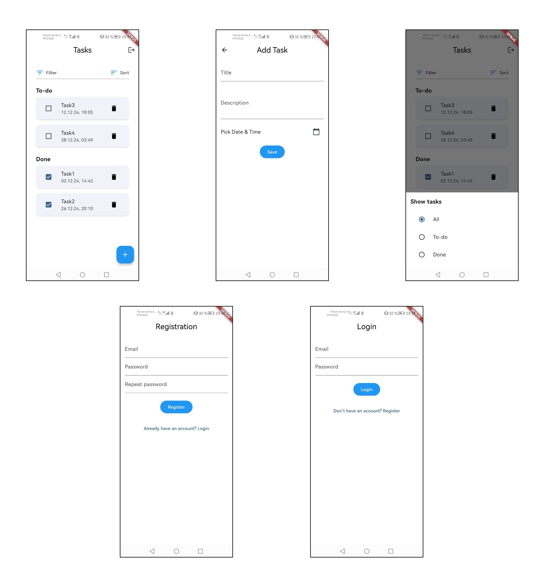

# To-Do App

A simple and intuitive To-Do application built with Flutter, Firebase, and Cubit architecture to help you manage your tasks efficiently. This app allows users to register, log in, and manage their tasks by adding, updating, filtering, and sorting tasks. The app also features task completion tracking and offers a user-friendly interface for managing tasks.

## Features

- **User Authentication**: Users can register, log in, and log out using Firebase Authentication.
- **Task Management**: Users can create, view, update, and delete tasks.
- **Task Sorting**: Tasks can be sorted by due date or title.
- **Task Filtering**: Tasks can be filtered to show only incomplete or completed tasks.
- **Real-time Data**: The app syncs tasks in real-time using Firebase Firestore, ensuring all data is up to date.
- **Responsive UI**: The app is designed to be fully responsive and provides an intuitive user experience across different screen sizes.

## Technologies Used

- **Flutter**: A framework for building natively compiled applications for mobile, web, and desktop from a single codebase.
- **Firebase**: Firebase Authentication for user management and Firebase Firestore for storing tasks.
- **BLoC (Cubit)**: State management pattern used for handling task-related logic in a scalable way.
- **GetIt**: A service locator used for managing dependencies like services for interacting with Firestore.

